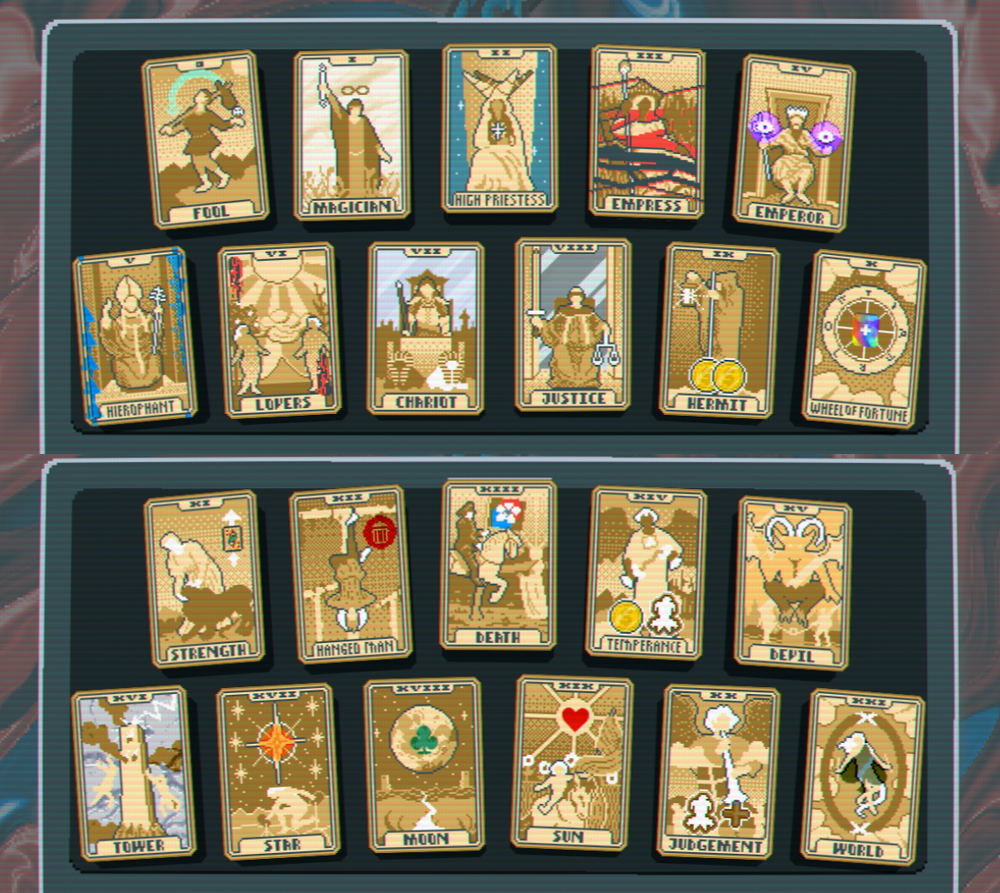

# Readable Tarots [Balatro mod]  

Readable Tarots is a vanilla‑friendly Balatro resource pack that makes Tarot cards easier to understand at a glance.  

Each Tarot card has been visually adjusted using only existing in‑game assets. Symbols and/or backgrounds are added or emphasized to more clearly represent what each Tarot does, helping with faster decision‑making without breaking the original aesthetic of the game.  

## Installation
Using Balatro Mod Manager is recomened, but not required. 
1. Install [Steammoded](https://github.com/Steamodded/smods)
2. Install [Malverk](https://github.com/Eremel/Malverk)
3. Download the latest release of [this mod](https://github.com/bosass/Readable-Tarots-Balatro-mod-/releases/latest)
4. Unzip the mod folder into your Balatro mods folder, usually AppData\Roaming\Balatro\Mods
5. In Balatro go to Options>Textures, select and apply Readable Tarots 
